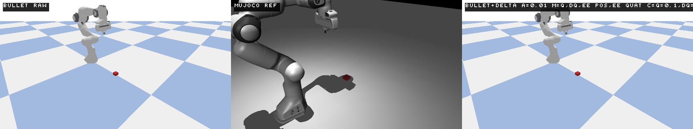

# Sim2Sim-OnePass Public Release

This curated layer is the fast path through the repository. It is designed so a new visitor can understand the claim, watch the evidence, inspect the canonical PASS artifacts, and run the shortest validation path without digging through the full development history.

## Companion Package

This branch adds a PyPI-ready package layer named `sim2sim-onepass`. It is a lightweight companion package for the public research release, not a standalone robotics simulator system. It provides an installable CLI, embedded docs access, results navigation, environment checks, and selected lightweight utilities around the curated repo.

Local editable install:

```powershell
python -m pip install -e .
```

Published PyPI install:

```powershell
python -m pip install sim2sim-onepass
```

PyPI package page:

```text
https://pypi.org/project/sim2sim-onepass/
```

CLI entrypoint:

```powershell
sim2sim-onepass --help
```

What the package does provide:

- repo navigation and public documentation access
- embedded lightweight markdown docs
- environment checking
- quick sanity checks on paired datasets
- rollout-check wrapper for model + norm + paired data paths
- guarded simulator workflow commands with clear errors when the full simulator stack is not present

What the package does not provide by default:

- full simulator environments
- full datasets
- giant reports dumps
- replay videos and large binary outputs
- local environments and machine-specific folders
- the full simulator env trees and internal training workspace

## Command Capability Levels

| Command | Category | Requirements |
| --- | --- | --- |
| `info` | Standalone | package install only |
| `quickstart` | Standalone | package install only |
| `repo-map` | Standalone | package install only |
| `results-summary` | Standalone | package install only |
| `visual-index` | Standalone | package install only |
| `docs` | Standalone | package install only |
| `check-env` | Standalone | package install only |
| `quick-sanity` | Dataset-dependent | paired datasets, or `--demo` for the tiny built-in fixture |
| `rollout-check` | Dataset-dependent | paired datasets, model, norm file, and optional extra `sim2sim-onepass[rollout]` |
| `alignment-gate` | Full repo / simulator dependent | full curated repo layout plus simulator dependencies |
| `alignment-report` | Full repo / simulator dependent | full curated repo layout plus simulator dependencies and workflow files |

## Pick Your Route

| If you want to... | Open this |
| --- | --- |
| See the project in one screen | [RESULTS_SUMMARY.md](RESULTS_SUMMARY.md) |
| Watch the visual evidence first | [VISUAL_INDEX.md](VISUAL_INDEX.md) |
| Run the shortest validation path | [QUICKSTART.md](QUICKSTART.md) |
| Inspect the packaged PASS bundle | [outputs/canonical_pass/](outputs/canonical_pass/) |
| Understand how the repo is organized | [REPO_MAP.md](REPO_MAP.md) |

## See It Before You Read It

| Triptych preview | Rollout figure |
| --- | --- |
| [](outputs/canonical_pass/preview/triptych_frame0.png) | [](outputs/canonical_pass/plots/rollout_phys_p95.png) |

Open the full visual package here:

- [VISUAL_INDEX.md](VISUAL_INDEX.md)
- [outputs/canonical_pass/videos/compare_triptych.mp4](outputs/canonical_pass/videos/compare_triptych.mp4)
- [outputs/canonical_pass/report.md](outputs/canonical_pass/report.md)

## The Claim In Plain Terms

After enforcing deterministic cross-simulator alignment between PyBullet and MuJoCo, this repo learns a residual next-state correction that:

- reduces Bullet-to-MuJoCo one-step physical error,
- remains stable under long-horizon rollout checks,
- passes holdout and alignment gates,
- and can be inspected visually through replay videos, triptychs, and overlay plots.

## Canonical Story

1. Deterministic paired plans are executed in PyBullet and MuJoCo.
2. A strict alignment gate blocks training if reset state, timing, or first-step consistency drift.
3. A residual model predicts the MuJoCo-minus-Bullet next-state gap.
4. Hard-mode stress evaluation verifies one-step accuracy, holdouts, and rollout stability.
5. Behavioral acceptance exports replay videos, triptychs, and overlay plots for inspection.

## Canonical Evidence

- Quantitative anchor: packaged in `outputs/canonical_pass/source_stress_report.md` and `outputs/canonical_pass/source_stress_metrics.json`
- Visual anchor: packaged in `outputs/canonical_pass/source_behavioral_report.md` and the copied videos and preview images
- Public-facing copied bundle: [outputs/canonical_pass/](outputs/canonical_pass/)
- Provenance map: [configs/canonical_sources.json](configs/canonical_sources.json)

## Exact Quickstart

This public repo is optimized for inspection first. Open [QUICKSTART.md](QUICKSTART.md) for the shortest path through the packaged evidence and for command references preserved from the source workspace.

## What Lives Where

- [outputs/canonical_pass/](outputs/canonical_pass/) contains the reviewer-facing proof artifacts.
- [examples/canonical_commands.ps1](examples/canonical_commands.ps1) contains exact rerun commands.
- [docs/CANONICAL_SOURCES.md](docs/CANONICAL_SOURCES.md) records provenance.
- [docs/PUBLISHING.md](docs/PUBLISHING.md) defines what to ship in a public release.
- The interactive website is published from the `gh-pages` branch.
- Package implementation lives under `src/sim2sim_onepass/`.
- License is [Apache-2.0](LICENSE).
