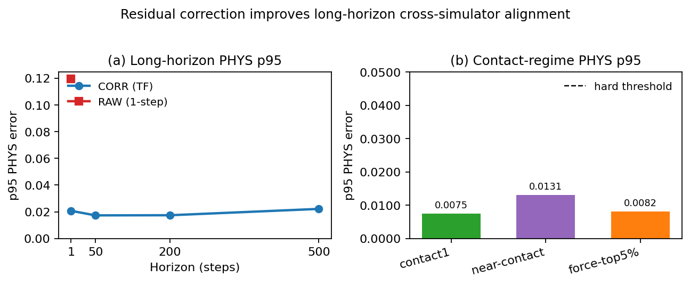

# Robotics Sim2Sim-OnePass

This repository is a curated public-facing proof package. Start with the release layer at [onepass_release/README.md](onepass_release/README.md).

## Start In 30 Seconds

Choose the path that matches how you want to explore:

| I want to... | Open this |
| --- | --- |
| Understand the project fast | [onepass_release/README.md](onepass_release/README.md) |
| Watch the visual evidence | [onepass_release/VISUAL_INDEX.md](onepass_release/VISUAL_INDEX.md) |
| See the canonical PASS metrics | [onepass_release/RESULTS_SUMMARY.md](onepass_release/RESULTS_SUMMARY.md) |
| Run the shortest validation path | [onepass_release/QUICKSTART.md](onepass_release/QUICKSTART.md) |
| Inspect the packaged proof bundle | [onepass_release/outputs/canonical_pass/](onepass_release/outputs/canonical_pass/) |

## What This Project Does

Sim2Sim-OnePass studies deterministic simulator-to-simulator transfer between PyBullet and MuJoCo for a Franka Panda manipulation setup. The central claim is that, after strict cross-simulator alignment, a learned residual correction reduces next-state mismatch and remains stable under long-horizon rollout checks.

## See It Before You Read It

| Triptych preview | Rollout summary |
| --- | --- |
|  |  |

## Canonical Proof Bundle

- Curated public package: [onepass_release/](onepass_release/)
- Release-side canonical report: [onepass_release/outputs/canonical_pass/report.md](onepass_release/outputs/canonical_pass/report.md)
- Release-side metrics summary: [onepass_release/outputs/canonical_pass/metrics_summary.json](onepass_release/outputs/canonical_pass/metrics_summary.json)

## Repo Navigation

- Public release layer: [onepass_release/README.md](onepass_release/README.md)
- Bundle map: [onepass_release/REPO_MAP.md](onepass_release/REPO_MAP.md)
- Packaging notes: [onepass_release/docs/PUBLISHING.md](onepass_release/docs/PUBLISHING.md)

## Provenance Note

This repository is the curated artifact layer. The release bundle preserves copied reports, metrics, plots, previews, and videos from the selected PASS sources. Source-path provenance is documented inside the bundle rather than by shipping the entire private development workspace.
